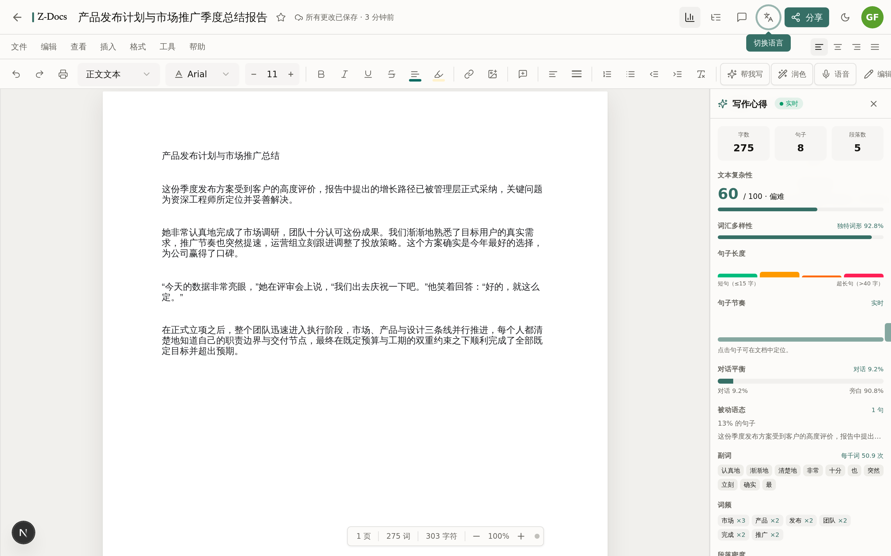
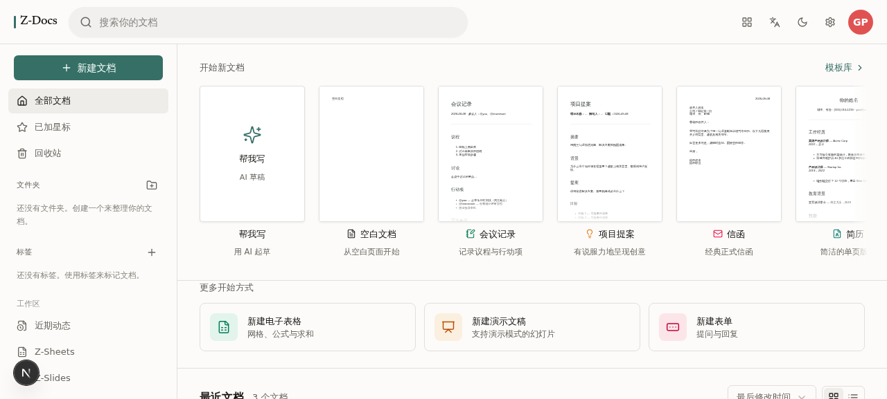
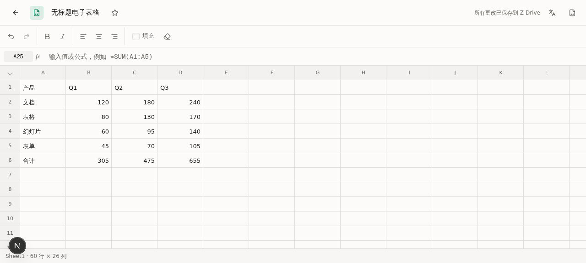
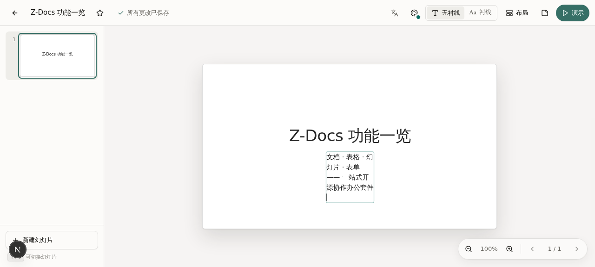
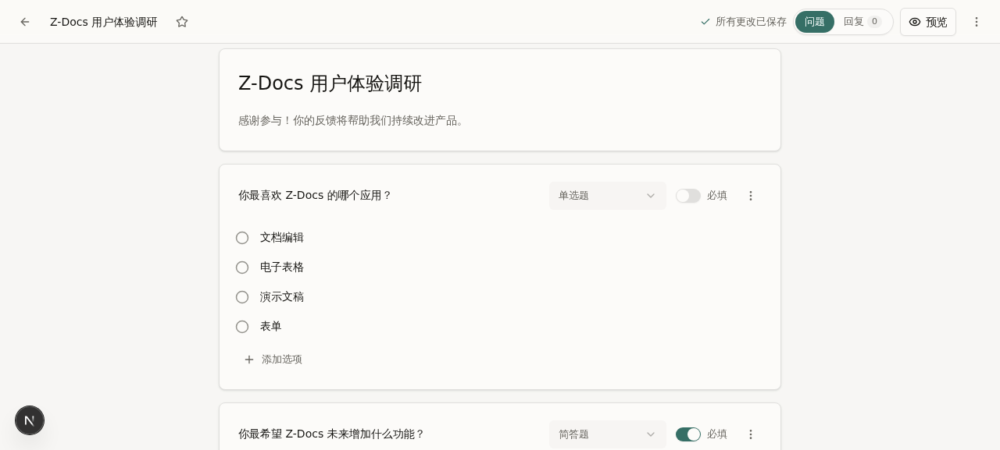
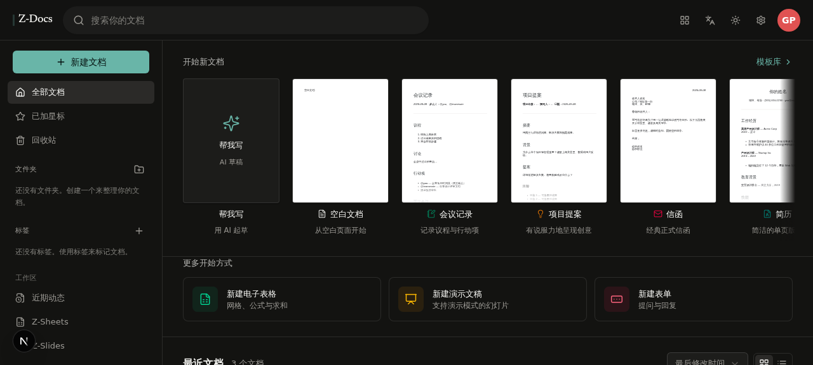
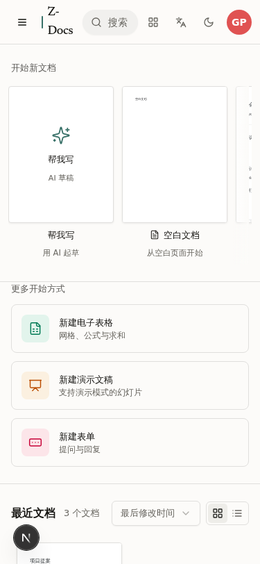

<div align="center">

# Z-Docs

**Open-source collaborative office suite — Docs · Sheets · Slides · Forms, all in one place**

[](https://z-docs.space-z.ai/)
[](./LICENSE)
[](https://nextjs.org)
[](https://react.dev)
[](https://www.typescriptlang.org)
[](./CONTRIBUTING.md)

**[Live Demo](https://z-docs.space-z.ai/)** · **[中文文档](./README.md)** · **[Changelog](./CHANGELOG.md)** · **[Contributing](./CONTRIBUTING.md)**

</div>

---

Z-Docs is a Google Workspace-style full-stack collaborative office suite: write documents with a **custom rich-text engine**, run **formulas** in spreadsheets, build themed slide decks, and publish forms that collect responses with live statistics — with **real-time collaboration**, **version history**, **comments & reactions**, and **PDF / DOCX / HTML / TXT export**.

Try it instantly in **guest mode** (data stays on your device); sign up to unlock cloud sync, sharing, and multi-user collaboration.

## Screenshots

| Document Editor | Workspace Home |
|:---:|:---:|
|  |  |

| Spreadsheets | Slides |
|:---:|:---:|
|  |  |

| Forms | Dark Mode |
|:---:|:---:|
|  |  |

<details>
<summary>📱 Mobile (375px responsive)</summary>



</details>

## ✨ Features

### 📝 Z-Docs Editor
- **Custom rich-text kernel** (contentEditable, no heavyweight editor dependency): bold/italic/underline/strikethrough, text color & highlight, font family & size, four alignments, line spacing, ordered/unordered lists, indentation, links, images
- **Real paper experience**: letter-size white pages, draggable margin ruler, zoom, live page/word/character counts
- **Comments & annotations**: selection-highlighted comments, reply threads, emoji reactions, resolved-state tracking
- **Version history**: automatic snapshots, previews, version diffing, one-click restore
- **Document outline**: heading sidebar with jump-to navigation
- **Find & replace**, **spell check** (AI suggestions, one-click apply), **AI write / polish**, **voice typing**
- **Writing insights (Ellipsus-parity)**: live insights rail in the editor (debounced real-time recompute, "Analyzing…" state on long docs, click-to-locate) + writing studio deep-dive (8 journey + 15 insight metrics) — **Chinese-native analysis**: 0–100 readability difficulty score (weighted sentence length / rare chars / very-long-sentence share, 30/40-char research anchors), 被字句 passive-voice detection, Chinese adverbs and 地-adverbials, character-bigram word frequency, Word-style word counting (CJK characters + non-Chinese words)
- **Remote image auto-embedding**: URL images are frozen to data-URLs via the built-in proxy (with SSRF guards) — self-contained documents, untainted export canvases, no dead-link rot
- **Multi-format export**: PDF (server-side vector rendering), DOCX (true OOXML), HTML, TXT, print view; export progress center (Google-Drive-style download cards, byte/page-level progress)
- **Template gallery**: blank / meeting notes / project proposal / letter / résumé — with real content
- Star, trash, duplicate, tags, folders, drag-to-reorder, bulk actions

### 📊 Z-Sheets
- Grid editing with a **formula engine** (`SUM` and more, range references, circular-reference detection `#CIRC!`)
- Cell bold/italic/align, column selection, autosave status bar

### 🎞️ Z-Slides
- Multiple layouts, theme colors, serif/sans-serif fonts
- Slide thumbnail rail, **fullscreen present mode** (keyboard navigation), speaker notes

### 📋 Z-Forms
- **6 question types**: short answer / paragraph / radio / checkbox / dropdown / star rating
- Required toggles, option management, live respondent preview
- Response collection with aggregate statistics

### 🧩 Platform
- **Real-time collaboration**: Yjs + Socket.io service — presence avatars, remote cursors, live document sync
- **Accounts**: signup / login / sessions; **guest mode** (local-only data, upgrade to cloud anytime)
- **Storage stats** (real usage · 15GB quota), **activity feed** (grouped by app)
- **Bilingual UI** (English / Chinese, full i18n), **dark mode**, **mobile responsive**
- Accessibility: semantic landmarks, complete aria labels, keyboard navigable

## 🏗️ Tech Stack

| Layer | Technology |
|---|---|
| Framework | Next.js 16 (App Router) · React 19 · TypeScript 5 |
| UI | Tailwind CSS 4 · shadcn/ui (New York) · Lucide icons · Framer Motion |
| State | Zustand (client) · TanStack Query (server) |
| Data | Prisma ORM · SQLite (15 models: docs/sheets/slides/forms/comments/versions/collab/activity…) |
| Realtime | Socket.io (dedicated service at `mini-services/collab-service`, port 3003) |
| AI | z-ai-web-dev-sdk (server-side only: write / polish / spell check) |
| Export | Server-side vector PDF · docx (OOXML) · jsPDF · sharp |

## 🚀 Quick Start

```bash
# 1. Install dependencies
bun install

# 2. Initialize the database (.env already has DATABASE_URL=file:./db/custom.db)
bun run db:push

# 3. Start the collaboration service (optional, needed for realtime collab)
cd mini-services/collab-service
bun install && bun run dev        # port 3003

# 4. Start the main app
cd ../..
bun run dev                       # http://localhost:3000
```

<details>
<summary>☁️ Production build</summary>

```bash
bun run build && bun run start
```

</details>

> 💡 Guest mode works out of the box; AI features (write / polish / spell check) require a runtime with z-ai-web-dev-sdk available.

## 📁 Project Structure

```
├── src/
│   ├── app/                    # App Router — single user route / + 40+ REST API routes
│   │   └── api/                # documents / sheets / slides / forms / comments /
│   │                           # folders / tags / auth / activity / storage / export / ai
│   ├── components/
│   │   ├── docs/               # App components
│   │   │   ├── editor/         # Document editor (canvas/toolbar/ruler/comments/versions/outline…)
│   │   │   ├── sheets/         # Spreadsheet (grid/formula engine/autosave)
│   │   │   ├── slides/         # Slides (layouts/themes/present mode)
│   │   │   ├── forms/          # Forms (builder/renderer/response stats)
│   │   │   ├── home/           # Workspace home (grid/templates/sidebar/dnd)
│   │   │   └── ui/             # Full shadcn/ui component set
│   │   └── providers.tsx
│   ├── hooks/                  # use-collab (Yjs client) / use-toast / use-mobile
│   ├── lib/                    # Editor DOM utilities / shared libs / full i18n dictionaries
│   └── store/                  # Zustand workspace state
├── mini-services/collab-service/   # Socket.io collab service (:3003, separate process)
├── prisma/schema.prisma        # 15 data models
├── db/custom.db                # SQLite database file
├── docs/screenshots/           # README screenshots
└── download/ upload/           # QA artifacts & user uploads (real dev-process data)
```

## 🤝 Contributing

Issues and PRs are welcome! See **[CONTRIBUTING.md](./CONTRIBUTING.md)** for the dev environment, code standards, and architecture conventions.

## 📄 License

[MIT](./LICENSE) © 2026 UWNE

---

<div align="center">

**If this project helps you, a Star ⭐ would be appreciated!**

</div>
