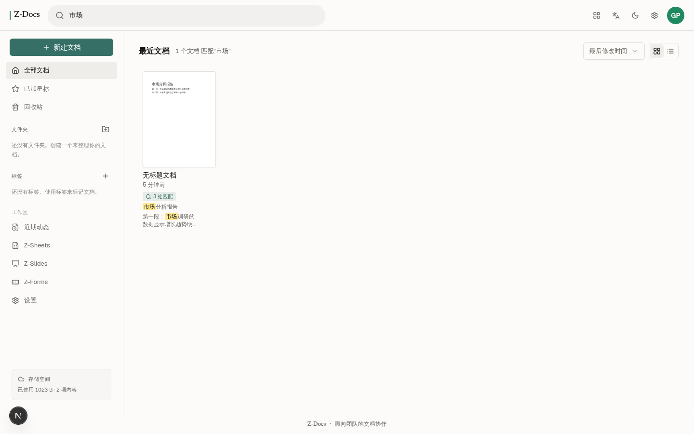

<div align="center">

# Z-Docs

**开源在线协作办公套件 —— 文档 · 表格 · 幻灯片 · 表单，一站俱全**

[](https://z-docs.space-z.ai/)
[](./LICENSE)
[](https://nextjs.org)
[](https://react.dev)
[](https://www.typescriptlang.org)
[](./CONTRIBUTING.md)

**[在线体验](https://z-docs.space-z.ai/)** · **[English](./README.en.md)** · **[更新日志](./CHANGELOG.md)** · **[参与贡献](./CONTRIBUTING.md)**

</div>

---

Z-Docs 是一套 Google Workspace 风格的全栈协作办公应用：用**自研富文本编辑器**书写文档，在电子表格里跑**公式引擎**，用主题化布局搭建幻灯片，五分钟发布一份可回收统计的表单 —— 并且支持**实时协作**、**版本历史**、**评论批注**与 **PDF / DOCX / HTML / TXT 多格式导出**。

无需账号即可游客模式试用（数据保存在本设备），注册后解锁云端同步、分享与多人协作。

## 截图预览

| 文档编辑器 | 首页工作台 |
|:---:|:---:|
|  |  |

| 全文搜索（匹配高亮） | 电子表格 |
|:---:|:---:|
|  |  |

| 幻灯片 | 表单 |
|:---:|:---:|
|  |  |

<details>
<summary>📱 移动端（375px）与 🌙 深色模式</summary>


</details>

## ✨ 功能特性

### 📝 Z-Docs 文档编辑器
- **自研富文本编辑内核**（contentEditable，无重型编辑器依赖）：加粗/斜体/下划线/删除线、文字颜色与高亮、字体字号、四种对齐、行距、有序/无序列表、缩进、链接、图片
- **真实纸张体验**：信纸尺寸白页、可拖动边距标尺、页面缩放、页数/字数/字符实时统计
- **评论与批注**：选区高亮评论、回复串、表情反应、解决状态跟踪
- **版本历史**：自动快照、历史预览、版本间 diff 对比、一键恢复
- **文档大纲**：标题结构侧栏、点击跳转
- **查找替换**、**拼写检查**（AI 修正建议一键应用）、**AI 帮我写 / 润色**、**语音输入**
- **写作洞察（Ellipsus 对标）**：实时洞察侧栏（写作时防抖重算，长文档「分析中…」态，点击定位）+ 写作工作室深潜视图（历程 8 项 + 洞察 15 项指标）——**中文原生分析**：0–100 可读性难度分（句长/生僻字/超长句加权，研究锚点 30/40 字）、被字句被动检测、中文副词与「地」字短语、二字词组词频、Word 口径字数统计（中文字符 + 非中文单词）
- **远程图片自动嵌入**：插入 URL 图片时经内置代理冻结为 data-URL（含 SSRF 防护）——文档自包含，导出不脏画布、外链失效不丢图
- **多格式导出**：PDF（服务端矢量渲染）、DOCX（真 OOXML）、HTML、TXT、打印视图；导出进度中心（Google Drive 式下载卡片，字节级/分页级进度）
- **模板库**：空白文档 / 会议记录 / 项目提案 / 信函 / 简历（含真实内容）
- **中文原生字体**：系统级中文字体栈（苹方/微软雅黑/思源黑体/宋体/楷体/黑体，跨平台互为回退）+ 中西双文字体选择器（带实时预览）
- 标星、回收站、复制副本、标签、文件夹、拖拽排序、批量操作
- **全文搜索**：多关键词 AND 匹配（标题 + 正文）· 匹配段落上下文高亮（Meilisearch 式命中总数 + 片段）· 点击结果直达文档并自动定位全部匹配

### 📊 Z-Sheets 电子表格
- 网格编辑、**公式引擎**（`SUM` 等函数、单元格区间引用、循环引用检测 `#CIRC!`）
- 单元格加粗/斜体/对齐、列选择、自动保存状态栏

### 🎞️ Z-Slides 幻灯片
- 多布局版式（标题页/标题正文/…）、主题色切换、衬线/无衬线字体
- 幻灯片缩略图轨道、**全屏演示模式**（键盘翻页）、演讲者备注

### 📋 Z-Forms 表单
- **6 种题型**：简答题 / 段落 / 单选题 / 多选题 / 下拉列表 / 星级评分
- 必填开关、选项管理、受访者视角实时预览
- 回复收集与统计汇总（作答率、逐题答案）

### 🧩 平台能力
- **实时协作**：基于 Yjs + Socket.io 的协作服务 —— 在线状态头像、远程光标、文档变更同步
- **账号体系**：注册 / 登录 / 会话管理；**游客模式**（数据仅存本设备，随时登录升级到云端）
- **存储统计**（真实测算用量，可选 `STORAGE_QUOTA_GB` 配额显示，绝不虚构总量）、**近期动态**活动流（按应用分组）
- **中英双语**（完整 i18n，`html lang` 正确同步）、**深色模式**、**三端响应式**（手机 <768 / 平板 768–1024 / 桌面 >1024：导航抽屉、幻灯片底部胶片条、编辑器侧栏浮层 + 遮罩、右栏互斥）
- 无障碍：语义化 landmark、完整 aria 标签、键盘可导航

## 🏗️ 技术栈

| 层 | 技术 |
|---|---|
| 框架 | Next.js 16（App Router）· React 19 · TypeScript 5 |
| UI | Tailwind CSS 4 · shadcn/ui（New York）· Lucide 图标 · Framer Motion |
| 状态 | Zustand（客户端）· TanStack Query（服务端） |
| 数据 | Prisma ORM · SQLite（15 个模型：文档/表格/幻灯片/表单/评论/版本/协作/动态…） |
| 实时 | Socket.io（独立协作服务 `mini-services/collab-service`，端口 3003） |
| AI | z-ai-web-dev-sdk（仅服务端调用：写作 / 润色 / 拼写检查） |
| 导出 | 服务端 PDF 矢量渲染 · docx（OOXML）· jsPDF · sharp |

## 🚀 快速开始

```bash
# 1. 安装依赖
bun install

# 2. 初始化数据库（.env 已含 DATABASE_URL=file:./db/custom.db）
bun run db:push

# 3. 启动协作服务（可选，实时协作功能需要）
cd mini-services/collab-service
bun install && bun run dev        # 端口 3003

# 4. 启动主应用
cd ../..
bun run dev                       # http://localhost:3000
```

<details>
<summary>☁️ 生产构建</summary>

```bash
bun run build && bun run start
```

</details>

> 💡 游客模式开箱即用；AI 功能（帮我写 / 润色 / 拼写检查）需要配置 z-ai-web-dev-sdk 可用的运行环境。

## 📁 项目结构

```
├── src/
│   ├── app/                    # App Router —— 唯一用户路由 / + 40+ REST API 路由
│   │   └── api/                # documents / sheets / slides / forms / comments /
│   │                           # folders / tags / auth / activity / storage / export / ai
│   ├── components/
│   │   ├── docs/               # 应用组件
│   │   │   ├── editor/         # 文档编辑器（画布/工具栏/标尺/评论/版本/大纲…）
│   │   │   ├── sheets/         # 电子表格（网格/公式引擎/自动保存）
│   │   │   ├── slides/         # 幻灯片（布局/主题/演示模式）
│   │   │   ├── forms/          # 表单（构建器/渲染器/回复统计）
│   │   │   ├── home/           # 首页工作台（网格/模板库/侧栏/拖拽）
│   │   │   └── ui/             # shadcn/ui 完整组件集
│   │   └── providers.tsx
│   ├── hooks/                  # use-collab（Yjs 客户端）/ use-toast / use-mobile
│   ├── lib/                    # 编辑器 DOM 工具 / 公共库 / 完整 i18n 词典
│   └── store/                  # Zustand 工作区状态
├── mini-services/collab-service/   # Socket.io 协作服务（:3003，独立进程）
├── prisma/schema.prisma        # 15 个数据模型
├── db/custom.db                # SQLite 数据库文件
├── docs/screenshots/           # README 截图
└── download/ upload/           # QA 产物与用户上传（开发过程真实数据）
```

## 🤝 参与贡献

欢迎 Issue 与 PR！开发环境、代码规范与架构约定见 **[CONTRIBUTING.md](./CONTRIBUTING.md)**。

## 📄 许可证

[MIT](./LICENSE) © 2026 UWNE

---

<div align="center">

**如果这个项目对你有帮助，欢迎 Star ⭐ 支持！**

</div>
